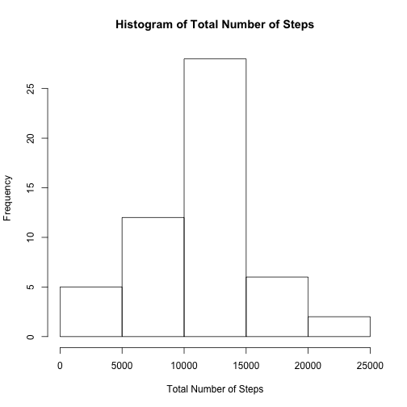

This assignment makes use of data from a personal activity monitoring device. This device collects data at 5 minute intervals through out the day. The data consists of two months of data from an anonymous individual collected during the months of October and November, 2012 and include the number of steps taken in 5 minute intervals each day.

Our goal is to answer 4 questions, namely:

1. What is mean total number of steps taken per day?
2. What is the average daily activity pattern?
3. How does inputing missing values change the results?
4. Are there differences in activity patterns between weekdays and weekends?

We are going to start by reading the data into R:


```r
library(dplyr) 
library(lattice)
setwd("..//PeerAssessment1/")
activityRaw <- read.csv("activity.csv")
```

## 1. What is mean total number of steps taken per day?

For this part of the assignment, we are going to ignore the missing values in the dataset.

Firstly, we need to calculate the total number of steps taken per day:


```r
NAomitted <- na.omit(activityRaw)
stepsDate <- select(NAomitted, steps, date) 
stepsDate <- group_by(stepsDate, date)
stepsByDate <- summarize(stepsDate, steps=sum(steps))
```

Here is a histogram that represents the total number of steps taken each day (built with the base plotting system):


```r
hist(stepsByDate$steps, xlab = "Total Number of Steps", main = "Histogram of Total Number of Steps")
```

 

We also need to calculate and report the **mean and median** of the total number of steps taken per day:


```r
meanSteps <- mean(stepsByDate$steps)
medianSteps <- median(stepsByDate$steps)
print(meanSteps)
```

```
## [1] 10766.19
```

```r
print(medianSteps)
```

```
## [1] 10765
```

## 2. What is the average daily activity pattern?

To answer this question, we will make a time series plot (i.e. type = "l") of the 5-minute interval (x-axis) and the average number of steps taken, averaged across all days (y-axis): 


```r
stepsByInterval <- select(NAomitted, interval, steps)
stepsByInterval <- group_by(stepsByInterval, interval)
stepsByInterval <- summarize(stepsByInterval, steps = mean(steps))
plot (stepsByInterval$interval, stepsByInterval$steps, type="l", col="blue", xlab="interval", ylab="average number of steps", main="Average Number of Steps by 5-min Interval")
```

 

To find out which 5-minute interval, on average across all the days in the dataset, contains the maximum number of steps, let's run this code:


```r
maxInterval <- subset (stepsByInterval, steps==max(stepsByInterval$steps))
print(maxInterval)
```

```
## Source: local data frame [1 x 2]
## 
##   interval    steps
## 1      835 206.1698
```

## 3. Imputing missing values

Note that there are a number of days/intervals where there are missing values (coded as NA). The presence of missing days may introduce bias into some calculations or summaries of the data.


```r
summary(activityRaw)
```

```
##      steps                date          interval     
##  Min.   :  0.00   2012-10-01:  288   Min.   :   0.0  
##  1st Qu.:  0.00   2012-10-02:  288   1st Qu.: 588.8  
##  Median :  0.00   2012-10-03:  288   Median :1177.5  
##  Mean   : 37.38   2012-10-04:  288   Mean   :1177.5  
##  3rd Qu.: 12.00   2012-10-05:  288   3rd Qu.:1766.2  
##  Max.   :806.00   2012-10-06:  288   Max.   :2355.0  
##  NA's   :2304     (Other)   :15840
```
As we can tell from this summary, there are 2304 rows with NAs in our dataset.

Let's fill the missing values with the means for corresponding 5-min intervals calculated above. We are going to create a new dataset that is equal to the original dataset but with the missing data filled in:


```r
NAseparately <- subset(activityRaw, is.na(activityRaw$steps))
NAseparately <- select(merge(NAseparately, stepsByInterval, by="interval"), steps=steps.y, date, interval)
activityNew <- bind_rows(NAomitted, NAseparately)
```

Let's doublecheck that there are no NAs in our new dataset:


```r
any(is.na(activityNew$steps))
```

```
## [1] FALSE
```

Now let's make a histogram of the total number of steps taken each day: 


```r
stepsDateNew <- select(activityNew, steps, date) 
stepsDateNew <- group_by(stepsDateNew, date)
stepsByDateNew <- summarize(stepsDateNew, steps=sum(steps))

hist(stepsByDateNew$steps, xlab = "Total Number of Steps", main = "Histogram of Total Number of Steps")
```

 

Now let's calculate the **mean and median** total number of steps taken per day in the new data set:


```r
meanStepsNew <- mean(stepsByDateNew$steps)
medianStepsNew <- median(stepsByDateNew$steps)
print(meanStepsNew)
```

```
## [1] 10766.19
```

```r
print(medianStepsNew)
```

```
## [1] 10766.19
```

As we can see, the numbers are almost exactly the same. Then, what is the impact of imputing missing data on the estimates of the total daily number of steps?

To answer this question let's put the 2 plots side-by-side.


```r
par(mfrow = c(1,2), mar=c(10, 4, 2, 2))
hist(stepsByDate$steps, xlab = "Total Number of Steps", main="Before", ylim=c(0, 40))
hist(stepsByDateNew$steps, xlab = "Total Number of Steps", main = "After", ylim=c(0, 40))
```

 

The frequency of the mean value is now significantly higher (which is perfectly normal, seeing how we handled the missing values), but all the other figures seem to be not much different.

## 4. Are there differences in activity patterns between weekdays and weekends?

To answer this last question, we will create a new factor variable in the dataset with two levels – “weekday” and “weekend” indicating whether a given date is a weekday or weekend day:


```r
activityNew <- transform(activityNew, date=as.POSIXct(date))
days <- mutate(activityNew, day=weekdays(date, abbreviate=FALSE))
days <- transform(days, day = as.factor(day))
levels(days$day) <- list(weekday = c("Monday", "Tuesday", "Wednesday", "Thursday", "Friday"), weekend = c("Saturday", "Sunday"))
```

And finally, let's make a panel plot containing a time series plot (i.e. type = "l") of the 5-minute interval (x-axis) and the average number of steps taken, averaged across all weekday days or weekend days (y-axis) (and let's use lattice, for a change). 


```r
stepsByDay <- summarize(group_by(days, day, interval), steps=mean(steps))
xyplot(steps~interval|day, data=stepsByDay, type="l")
```

 
